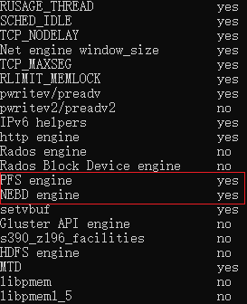

# Fio for Curve README
## 1. 准备

### 1.1 确保curvebs卷已经创建，并且没有被其他用户打开。
### 1.2 编译fio
```    
./configure
make
```

configure时确保PFS和NEBD都是yes



## 2. 测试curve卷
### 2.1 配置fio

创建配置文件 nebd_global.fio, 包含如下内容
```
ioengine=nebd
nebd=cbd:pool//pfs_test_  #此处可修改成你的卷名
size=10G
bs=16K
direct=1
time_based
```

创建配置文件 nebd_seqw.fio, 该文件用于做顺序写测试，包含如下内容
```
[global]
include nebd_global.fio

[seqwrite]
rw=write
iodepth=1
numjobs=1
runtime=900
```

创建配置文件 nebd_randw.fio，该文件用于做随机写测试，包含如下内容
```
[global]
include nebd_global.fio

[randwrite]
rw=randwrite
iodepth=16
numjobs=10
runtime=900
```

### 2.2 测试

顺序写测试:
sudo ./fio ./nebd_seqw.fio

随机写测试:
sudo ./fio ./nebd_randw.fio

## 3. 测试pfs
### 3.1 启动pfs守护进程

假设你有一个curvebs卷名cbd:pool//pfs_test_, 启动pfs守护进程如下:

```
sudo /usr/local/polarstore/pfsd/bin/start_pfsd.sh -p pool@@pfs_test_
```
注意pfs使用curvebs卷名的方式是: 'cbd:'前缀是不要的，'//'要需要转换成'@@''

创建pfs文件系统:
```
sudo pfs -C curve -H 1 mkfs pool@@pfs_test_
```

### 3.2 配置fio
创建配置文件 pfs_global.fio
```
ioengine=pfs
cluster=curve
pbd=pool@@pfs_test_
filename=/pool@@pfs_test_/fio-write #此处改成你的nebd卷名后跟文件名fio-write
size=10G
bs=16K
direct=1
time_based
```

创建配置文件 pfs_seqw.fio，该文件用于做顺序写测试，包含如下内容
```
[global]
include pfs_global.fio

[seqwrite]
runtime=900
rw=write
iodepth=1
numjobs=1
```

创建配置文件 pfs_randw.fio，该文件用于做随机写测试，包含如下内容
```
[global]
include pfs_global.fio

[randwrite]
rw=randwrite
iodepth=16
numjobs=10
runtime=900
```
### 3.3 测试

顺序写测试:
sudo ./fio ./pfs_seqw.fio

随机写测试:
sudo ./fio ./pfs_randw.fio
